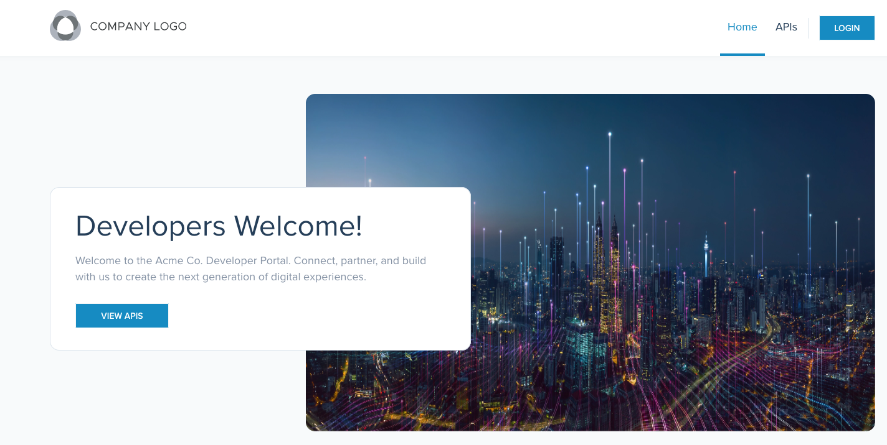

## Lab 19 - Portal Backstage <a name="lab-19---portal-backstage-"></a>

An important feature for dev teams is being able to publish and consume APIs in a common location.  Developer portals based on OpenAPI specifications have grown in popularity and the open source project Backstage is the most popular in this space.  In this lab, you will see how you can utilize Gloo's Backstage integration to publish APIs for your teams and provide some advanced functionality when combining this with Gloo Gateway such as usage plans, rate limiting and advanced metrics.

We will leverage bookinfo and httpbin applications for our portal.

### Update ops-team Workspace
First, we need to update our ops-team workspace to include bookinfo.
```shell
kubectl apply --context mgmt -f data/ops-team.yaml
```

### Routing to Bookinfo and HTTPBin
First, we need to create a RouteTable for our applications.
```shell
kubectl apply --context mgmt -f - <<EOF
apiVersion: networking.gloo.solo.io/v2
kind: RouteTable
metadata:
  name: main-bookinfo
  namespace: ops-team
spec:
  hosts:
    - web-bookinfo.example.com
    - lob-bookinfo.example.com
  virtualGateways:
    - name: ingress
      namespace: ops-team
      cluster: mgmt
  workloadSelectors: []
  http:
    - name: root
      matchers:
      - uri:
          prefix: /
      delegate:
        routeTables:
          - labels:
              expose: "true"
            workspace: bookinfo
          - labels:
              expose: "true"
            workspace: ops-team
        sortMethod: ROUTE_SPECIFICITY
---
apiVersion: networking.gloo.solo.io/v2
kind: RouteTable
metadata:
  name: main-httpbin
  namespace: ops-team
spec:
  hosts:
    - web-httpbin.example.com
  virtualGateways:
    - name: ingress
      namespace: ops-team
      cluster: mgmt
  workloadSelectors: []
  http:
    - name: root
      matchers:
      - uri:
          prefix: /
      delegate:
        routeTables:
          - labels:
              expose: "true"
            workspace: httpbin
        sortMethod: ROUTE_SPECIFICITY
EOF
```

The ops-team has created 2 RouteTables that will delegate to the bookinfo and httpbin teams.  The teams in charge of these workspaces can expose their services through the gateway.  The ops-team can use this main RouteTable to enforce a global WAF policy, but also to have control over which hostnames and paths can be used by each application team.

Then, the bookinfo team can create a RouteTable to determine how they want to handle the traffic.
```shell
kubectl apply --context mgmt -f - <<EOF
apiVersion: networking.gloo.solo.io/v2
kind: RouteTable
metadata:
  name: productpage
  namespace: bookinfo-team
  labels:
    expose: "true"
spec:
  http:
    - name: productpage
      matchers:
      - uri:
          exact: /productpage
      - uri:
          prefix: /static
      - uri:
          prefix: /api/v1/products
      forwardTo:
        destinations:
          - ref:
              name: productpage
              namespace: bookinfo-frontends
              cluster: web
            port:
              number: 9080
EOF
```

Let's add the domain to our /etc/hosts file.  First, you will need to find the IP address of the ingress gateway
```shell
nslookup ${GLOO_GATEWAY_HTTPS}
```

Then, using this ip address, modify your /etc/hosts file to map it to web-bookinfo.example.com and web-httpbin.example.com.

You can access the productpage service using this URL - https://web-bookinfo.example.com/productpage.

### Deploy an IdP
If you need to deploy a test IdP, you should do so in a VM or another cluster where there are fewer security restrictions.  See 00-keycloak lab for this information.

Set the host url of your IdP to KEYCLOAK_URL.  We will use that env variable in our auth policy.

### Expose the productpage API securely
Gloo Platform includes a developer portal, which is well integrated with its core API.

Let's start with API discovery.

Annotate the productpage service to allow the Gloo Platform agent to discovery its API.
```shell
kubectl --context web -n bookinfo-frontends annotate service productpage gloo.solo.io/scrape-openapi-source=https://raw.githubusercontent.com/istio/istio/master/samples/bookinfo/swagger.yaml --overwrite
kubectl --context web -n bookinfo-frontends annotate service productpage gloo.solo.io/scrape-openapi-pull-attempts="3" --overwrite
kubectl --context web -n bookinfo-frontends annotate service productpage gloo.solo.io/scrape-openapi-retry-delay=5s --overwrite
kubectl --context web -n bookinfo-frontends annotate service productpage gloo.solo.io/scrape-openapi-use-backoff="true" --overwrite
```

An APIDoc object should be created.
```shell
kubectl --context web -n bookinfo-frontends get apidoc productpage-service -o yaml
```

If nothing appears, restart Redis.

You should get something like this.
```shell
apiVersion: apimanagement.gloo.solo.io/v2
kind: ApiDoc
metadata:
  creationTimestamp: "2023-04-05T06:48:33Z"
  generation: 1
  labels:
    reconciler.mesh.gloo.solo.io/name: schema-reporter-service
  name: productpage-service
  namespace: bookinfo-frontends
  resourceVersion: "116408"
  uid: 2ae9188c-713e-4ba3-86a6-8689f55cda0f
spec:
  openapi:
    inlineString: '{"components":{"schemas":{"Product":{"description":"Basic information
      about a product","properties":{"descriptionHtml":{"description":"Description
      of the book - may contain HTML tags","type":"string"},"id":{"description":"Product
      id","format":"int32","type":"integer"},"title":{"description":"Title of the
      book","type":"string"}},"required":["id","title","descriptionHtml"],"type":"object"},"ProductDetails":{"description":"Detailed
      information about a product","properties":{"ISBN-10":{"description":"ISBN-10
      of the book","type":"string"},"ISBN-13":{"description":"ISBN-13 of the book","type":"string"},"author":{"description":"Author
      of the book","type":"string"},"id":{"description":"Product id","format":"int32","type":"integer"},"language":{"description":"Language
      of the book","type":"string"},"pages":{"description":"Number of pages of the
      book","format":"int32","type":"integer"},"publisher":{"description":"Publisher
      of the book","type":"string"},"type":{"description":"Type of the book","enum":["paperback","hardcover"],"type":"string"},"year":{"description":"Year
      the book was first published in","format":"int32","type":"integer"}},"required":["id","publisher","language","author","ISBN-10","ISBN-13","year","type","pages"],"type":"object"},"ProductRatings":{"description":"Object
      containing ratings of a product","properties":{"id":{"description":"Product
      id","format":"int32","type":"integer"},"ratings":{"additionalProperties":{"type":"string"},"description":"A
      hashmap where keys are reviewer names, values are number of stars","type":"object"}},"required":["id","ratings"],"type":"object"},"ProductReviews":{"description":"Object
      containing reviews for a product","properties":{"id":{"description":"Product
      id","format":"int32","type":"integer"},"reviews":{"description":"List of reviews","items":{"$ref":"#/components/schemas/Review"},"type":"array"}},"required":["id","reviews"],"type":"object"},"Rating":{"description":"Rating
      of a product","properties":{"color":{"description":"Color in which stars should
      be displayed","enum":["red","black"],"type":"string"},"stars":{"description":"Number
      of stars","format":"int32","maximum":5,"minimum":1,"type":"integer"}},"required":["stars","color"],"type":"object"},"Review":{"description":"Review
      of a product","properties":{"rating":{"$ref":"#/components/schemas/Rating"},"reviewer":{"description":"Name
      of the reviewer","type":"string"},"text":{"description":"Review text","type":"string"}},"required":["reviewer","text"],"type":"object"}}},"externalDocs":{"description":"Learn
      more about the Istio BookInfo application","url":"https://istio.io/docs/samples/bookinfo.html"},"info":{"description":"This
      is the API of the Istio BookInfo sample application.","license":{"name":"Apache
      2.0","url":"http://www.apache.org/licenses/LICENSE-2.0.html"},"termsOfService":"https://istio.io/","title":"BookInfo
      API","version":"1.0.0"},"openapi":"3.0.3","paths":{"/products":{"get":{"description":"List
      all products available in the application with a minimum amount of information.","operationId":"getProducts","responses":{"200":{"content":{"application/json":{"schema":{"items":{"$ref":"#/components/schemas/Product"},"type":"array"}}},"description":"successful
      operation"}},"summary":"List all products","tags":["product"]}},"/products/{id}":{"get":{"description":"Get
      detailed information about an individual product with the given id.","operationId":"getProduct","parameters":[{"description":"Product
      id","in":"path","name":"id","required":true,"schema":{"format":"int32","type":"integer"}}],"responses":{"200":{"content":{"application/json":{"schema":{"$ref":"#/components/schemas/ProductDetails"}}},"description":"successful
      operation"},"400":{"description":"Invalid product id"}},"summary":"Get individual
      product","tags":["product"]}},"/products/{id}/ratings":{"get":{"description":"Get
      ratings for a product, including stars and their color.","operationId":"getProductRatings","parameters":[{"description":"Product
      id","in":"path","name":"id","required":true,"schema":{"format":"int32","type":"integer"}}],"responses":{"200":{"content":{"application/json":{"schema":{"$ref":"#/components/schemas/ProductRatings"}}},"description":"successful
      operation"},"400":{"description":"Invalid product id"}},"summary":"Get ratings
      for a product","tags":["rating"]}},"/products/{id}/reviews":{"get":{"description":"Get
      reviews for a product, including review text and possibly ratings information.","operationId":"getProductReviews","parameters":[{"description":"Product
      id","in":"path","name":"id","required":true,"schema":{"format":"int32","type":"integer"}}],"responses":{"200":{"content":{"application/json":{"schema":{"$ref":"#/components/schemas/ProductReviews"}}},"description":"successful
      operation"},"400":{"description":"Invalid product id"}},"summary":"Get reviews
      for a product","tags":["review"]}}},"servers":[{"url":"/api/v1"}],"tags":[{"description":"Information
      about a product (in this case a book)","name":"product"},{"description":"Review
      information for a product","name":"review"},{"description":"Rating information
      for a product","name":"rating"}]}'
  servedBy:
  - destinationSelector:
      port:
        number: 9080
      selector:
        cluster: cluster1
        name: productpage
        namespace: bookinfo-frontends
```

Note that you can create the APIDoc manually to allow you:
* to provide the OpenAPI document as code
* to declare an API running outside of Kubernetes (ExternalService)
* to target a service running on a different cluster (VirtualDestination)

We can now expose the API through Ingress Gateway using a RouteTable.
```shell
kubectl apply --context mgmt -f - <<EOF
apiVersion: networking.gloo.solo.io/v2
kind: RouteTable
metadata:
  name: productpage-api-v1
  namespace: bookinfo-team
  labels:
    expose: "true"
    portal-users: "true"
    api: bookinfo
spec:
  portalMetadata:
    title: BookInfo REST API v1
    description: REST API for the Bookinfo application
    apiProductId: bookinfo
    apiProductDisplayName: BookInfo REST API
    apiVersion: v1
    customMetadata:
      lifecyclePhase: "General Availability"
  http:
    - matchers:
      - uri:
          prefix: /api/bookinfo/v1
      labels:
        apikeys: "true"
        ratelimited: "true"
        api: "productpage"
      forwardTo:
        pathRewrite: /api/v1/products
        destinations:
          - ref:
              name: productpage
              namespace: bookinfo-frontends
              cluster: web
            port:
              number: 9080
EOF
```

You can see some labels set at the RouteTable and at the route level. We're going to take advantage of them later.
The portalMetadata section will be used when we'll expose the API through the developer portal.
You can think about this RouteTable as an API product. Also, note that we defined the version to be v1.
You should now be able to access the API through the gateway without any authentication.

```shell
curl -k "https://web-bookinfo.example.com/api/bookinfo/v1"
```

Here is the expected output:

```shell
[{"id": 0, "title": "The Comedy of Errors", "descriptionHtml": "<a href=\"https://en.wikipedia.org/wiki/The_Comedy_of_Errors\">Wikipedia Summary</a>: The Comedy of Errors is one of <b>William Shakespeare's</b> early plays. It is his shortest and one of his most farcical comedies, with a major part of the humour coming from slapstick and mistaken identity, in addition to puns and word play."}]
```

You generally want to secure the access. Let's use API keys for that.

You need to create an ExtAuthPolicy.
```shell
kubectl apply --context web -f - <<EOF
apiVersion: security.policy.gloo.solo.io/v2
kind: ExtAuthPolicy
metadata:
  name: bookinfo-apiauth
  namespace: bookinfo-frontends
spec:
  applyToRoutes:
  - route:
      labels:
        apikeys: "true"
  config:
    server:
      name: ext-auth-server
      namespace: gloo-platform-addons
      cluster: web
    glooAuth:
      configs:
        - apiKeyAuth:
            headerName: api-key
            headersFromMetadataEntry:
              X-Solo-Plan:
                name: usagePlan
                required: true
            k8sSecretApikeyStorage:
              labelSelector:
                auth: api-key
EOF
```

The policy will be attached to our RouteTable due to the label apikeys: "true" we set in its route.

Try to access the API without authentication.
```shell
curl -k "https://web-bookinfo.example.com/api/bookinfo/v1" -I
```

The access is refused (401 response)
```shell
HTTP/2 401
www-authenticate: API key is missing or invalid
date: Sun, 11 Feb 2024 15:46:51 GMT
server: istio-envoy
```

Let's create an API key for a user user1.
```shell
export API_KEY_USER1=apikey1
kubectl apply --context web -f - <<EOF
apiVersion: v1
kind: Secret
metadata:
  name: user1
  namespace: bookinfo-frontends
  labels:
    auth: api-key
type: extauth.solo.io/apikey
stringData:
  api-key: apikey1
  user-id: user1
  user-email: user1@solo.io
  usagePlan: gold
EOF
```

Now, you should be able to access the API using this API key.
```shell
curl -k -H "api-key: ${API_KEY_USER1}" "https://web-bookinfo.example.com/api/bookinfo/v1"
```

We'll see later that the API keys can be created on demand by the end user through the developer portal (and stored on Redis for better scalability).

So, we've secured the access to our API, but you generally want to limit the usage of your API.

We're going to create 3 usage plans (bronze, silver and gold).

The user user1 is a gold user (gold base64 is Z29sZA==).

The X-Solo-Plan is created by the ExtAuthPolicy we have created earlier.

Then, we need to create a RateLimitServerConfig object to define the limits based on the descriptors we will use later.
```shell
kubectl apply --context mgmt -f - <<EOF
apiVersion: admin.gloo.solo.io/v2
kind: RateLimitServerConfig
metadata:
  name: productpage
  namespace: bookinfo-team
spec:
  destinationServers:
  - ref:
      cluster: web
      name: rate-limiter
      namespace: gloo-platform-addons
    port:
      name: grpc
  raw:
    setDescriptors:
      - simpleDescriptors:
          - key: userId
          - key: usagePlan
            value: bronze
        rateLimit:
          requestsPerUnit: 1
          unit: MINUTE
      - simpleDescriptors:
          - key: userId
          - key: usagePlan
            value: silver
        rateLimit:
          requestsPerUnit: 3
          unit: MINUTE
      - simpleDescriptors:
          - key: userId
          - key: usagePlan
            value: gold
        rateLimit:
          requestsPerUnit: 5
          unit: MINUTE
EOF
```

It defines the limits for each plan.

After that, we need to create a RateLimitPolicy to define the descriptors.
```shell
kubectl apply --context mgmt -f - <<EOF
apiVersion: trafficcontrol.policy.gloo.solo.io/v2
kind: RateLimitPolicy
metadata:
  name: productpage
  namespace: bookinfo-team
spec:
  applyToRoutes:
  - route:
      labels:
        ratelimited: "true"
  config:
    serverSettings:
      name: rate-limit-server
      namespace: ops-team
      cluster: mgmt
    raw:
      rateLimits:
      - setActions:
        - requestHeaders:
            descriptorKey: usagePlan
            headerName: X-Solo-Plan
        - metadata:
            descriptorKey: userId
            metadataKey:
              key: envoy.filters.http.ext_authz
              path:
                - key: userId
    ratelimitServerConfig:
      name: productpage
      namespace: bookinfo-team
      cluster: mgmt
    phase:
      postAuthz:
        priority: 1

EOF
```

This policy will be attached to our RouteTable due to the label ratelimited: "true" we set in its route.

Try to access the API more than 5 times.
```shell
for i in `seq 1 10`; do curl -k -H "api-key: ${API_KEY_USER1}" "https://web-bookinfo.example.com/api/bookinfo/v1" -I; done
```

You should be rate limited.
```shell
HTTP/2 429
x-envoy-ratelimited: true
date: Sun, 11 Feb 2024 15:52:41 GMT
server: istio-envoy
```

### Expose an external API and stitch it with another one
You can also expose external APIs.

Let's create an external service to define how to access the host openlibrary.org.
```shell
kubectl apply --context mgmt -f - <<EOF
apiVersion: networking.gloo.solo.io/v2
kind: ExternalService
metadata:
  name: openlibrary
  namespace: bookinfo-team
  labels:
    expose: "true"
spec:
  hosts:
  - openlibrary.org
  ports:
  - name: http
    number: 80
    protocol: HTTP
  - name: https
    number: 443
    protocol: HTTPS
    clientsideTls: {}
EOF
```

Then, you need to create an ApiSchemaDiscovery object to tell Gloo Platform how to fetch the OpenAPI document.
```shell
kubectl apply --context web -f - <<EOF
apiVersion: apimanagement.gloo.solo.io/v2
kind: ApiSchemaDiscovery
metadata:
  name: openlibrary
  namespace: bookinfo-frontends
spec:
  openapi:
    fetchEndpoint:
      url: "https://openlibrary.org/static/openapi.json"
  servedBy:
  - destinationSelector:
      kind: EXTERNAL_SERVICE
      port:
        number: 443
      selector:
        cluster: mgmt
        name: openlibrary
        namespace: bookinfo-team
EOF
```

An APIDoc should be automatically created.
```shell
kubectl --context web -n bookinfo-frontends get apidoc openlibrary -o yaml
```

Finally, you can create a new RouteTable to stitch together the /search.json path with the existing Bookinfo API.
```shell
kubectl apply --context mgmt -f - <<EOF
apiVersion: networking.gloo.solo.io/v2
kind: RouteTable
metadata:
  name: productpage-api-v2
  namespace: bookinfo-team
  labels:
    expose: "true"
    portal-users: "true"
    api: bookinfo
spec:
  portalMetadata:
    title: BookInfo REST API v2
    description: REST API for the Bookinfo application
    apiProductId: bookinfo
    apiProductDisplayName: BookInfo REST API
    apiVersion: v2
    customMetadata:
      lifecyclePhase: "General Availability"
  http:
    - matchers:
      - uri:
          prefix: /api/bookinfo/v2/search.json
      labels:
        apikeys: "true"
        ratelimited: "true"
        api: "productpage"
      forwardTo:
        pathRewrite: /search.json
        hostRewrite: openlibrary.org
        destinations:
          - kind: EXTERNAL_SERVICE 
            ref:
              name: openlibrary
              namespace: bookinfo-team
              cluster: mgmt
            port:
              number: 443
    - matchers:
      - uri:
          regex: /api/bookinfo/v2/authors/([^.]+).json
      labels:
        apikeys: "true"
        ratelimited: "true"
        api: "productpage"
      forwardTo:
        hostRewrite: openlibrary.org
        regexRewrite:
          pattern:
            regex: /api/bookinfo/v2/authors/([^.]+).json
          substitution: /authors/\1.json
        destinations:
          - kind: EXTERNAL_SERVICE 
            ref:
              name: openlibrary
              namespace: bookinfo-team
              cluster: mgmt
            port:
              number: 443
    - matchers:
      - uri:
          prefix: /api/bookinfo/v2
      labels:
        apikeys: "true"
        ratelimited: "true"
        api: "productpage"
      forwardTo:
        pathRewrite: /api/v1/products
        destinations:
          - ref:
              name: productpage
              namespace: bookinfo-frontends
              cluster: web
            port:
              number: 9080
EOF
```

You can think about this RouteTable as the same API product as the one we've created previously, but this time we defined the version to be v2.

You can check the new path is available.
```shell
curl -k -H "api-key: ${API_KEY_USER1}" "https://web-bookinfo.example.com/api/bookinfo/v2/search.json?title=The%20Comedy%20of%20Errors&fields=language&limit=1"
```

Note that we have also exposed the /authors/{olid}.json path to demonstrate how we can use regular expressions to capture path parameters.

You can try it out with the following command.
```shell
curl -k -H "api-key: ${API_KEY_USER1}" "https://web-bookinfo.example.com/api/bookinfo/v2/authors/OL23919A.json"
```

### Expose the dev portal backend
Now that your API has been exposed securely and our plans defined, you probably want to advertise it through a developer portal.

Two components are serving this purpose:
* the Gloo Platform portal backend which provides an API
* the Gloo Platform portal frontend which consumes this API

In this lab, we're going to setup the Gloo Platform portal backend.

The ops team should create a parent RouteTable for the portal.
```shell
kubectl apply --context mgmt -f - <<EOF
apiVersion: networking.gloo.solo.io/v2
kind: RouteTable
metadata:
  name: main-portal
  namespace: ops-team
spec:
  hosts:
    - web-portal.example.com
  virtualGateways:
    - name: ingress
      namespace: ops-team
      cluster: mgmt
  workloadSelectors: []
  http:
    - name: root
      matchers:
      - uri:
          prefix: /
      delegate:
        routeTables:
          - labels:
              expose: "true"
              portal: "true"
            workspace: ops-team
        sortMethod: ROUTE_SPECIFICITY
EOF
```

After that, you can expose the portal API through Ingress Gateway using a RouteTable.
```shell
kubectl apply --context mgmt -f - <<EOF
apiVersion: networking.gloo.solo.io/v2
kind: RouteTable
metadata:
  name: portal-server
  namespace: ops-team
  labels:
    expose: "true"
    portal: "true"
spec:
  defaultDestination:
    ref:
      name: gloo-mesh-portal-server
      namespace: gloo-platform-addons
      cluster: web
    port:
      number: 8080
  http:
    - forwardTo:
        pathRewrite: /v1
      name: authn-api-and-usage-plans-access-token
      labels:
        oauth: "access-token"
        route: portal-api
      matchers:
        - uri:
            prefix: /portal-server/v1
          headers:
            - name: Authorization
    - forwardTo:
        pathRewrite: /v1
      name: authn-api-and-usage-plans
      labels:
        oauth: "authorization-code"
        route: portal-api
      matchers:
        - uri:
            prefix: /portal-server/v1
          headers:
            - name: Cookie
              #value: ".*?id_token=.*" # if not storing the id_token in Redis
              value: ".*?keycloak-session=.*" # if storing the id_token in Redis
              regex: true
    - name: no-auth-apis
      forwardTo:
        pathRewrite: /v1
      labels:
        route: portal-api
      matchers:
        - uri:
            prefix: /portal-server/v1
EOF
```

Make sure your /etc/hosts is updated for web-portal.example.com. 
You should now be able to access the portal API through the gateway without any authentication.
```shell
curl -k "https://web-portal.example.com/portal-server/v1/apis"
```

Here is the expected output.
```
{"message":"portal config not found for host: ***"}
```

You can see that no portal configuration has been found.  Let's create it.

```shell
kubectl apply --context mgmt -f - <<EOF
apiVersion: apimanagement.gloo.solo.io/v2
kind: Portal
metadata:
  name: portal
  namespace: ops-team
spec:
  portalBackendSelectors:
    - selector:
        cluster: web
        namespace: gloo-platform-addons
  domains:
  - "*"
  usagePlans:
    - name: bronze
      displayName: "Bronze Plan"
      description: "A basic usage plan"
    - name: silver
      displayName: "Silver Plan"
      description: "A better usage plan"
    - name: gold
      displayName: "Gold Plan"
      description: "The best usage plan!"
  apis:
    - labels:
        api: bookinfo
EOF
```

Try again to access the API.
```shell
curl -k "https://web-portal.example.com/portal-server/v1/apis"
```

The response should be an empty array: [].

This is expected because you are not authenticated.  Users will authenticate on the frontends using OIDC and get access to specific APIs and plans based on the claims they will have in the returned JWT token.

You need to create a PortalGroup to define these rules.
```shell
kubectl apply --context mgmt -f - <<EOF
apiVersion: apimanagement.gloo.solo.io/v2
kind: PortalGroup
metadata:
  name: portal-users
  namespace: ops-team
spec:
  name: portal-users
  description: a group for users accessing the customers APIs
  membership:
    - claims:
        - key: group
          value: users
  accessLevel:
    apis:
    - labels:
        portal-users: "true"
    usagePlans:
    - gold
EOF
```

All the users who will have a JWT token containing the claim group with the value users will have access to the APIs containing the label portal-users: "true".

The RouteTable we have created for the bookinfo API has this label.

### Deploy and expose the dev portal frontend
The developer frontend is provided as a fully functional template to allow you to customize it based on your own requirements.

Let's deploy it.
```shell
kubectl apply --context web -f - <<EOF
apiVersion: v1
kind: ServiceAccount
metadata:
  name: portal-frontend
  namespace: gloo-platform-addons
---
apiVersion: v1
kind: Service
metadata:
  name: portal-frontend
  namespace: gloo-platform-addons
  labels:
    app: portal-frontend
    service: portal-frontend
spec:
  ports:
  - name: http
    port: 4000
    targetPort: 4000
  selector:
    app: portal-frontend
---
apiVersion: apps/v1
kind: Deployment
metadata:
  name: portal-frontend
  namespace: gloo-platform-addons
spec:
  replicas: 1
  selector:
    matchLabels:
      app: portal-frontend
  template:
    metadata:
      labels:
        app: portal-frontend
    spec:
      serviceAccountName: portal-frontend
      containers:
      - image: djannot/portal-frontend:0.1
        args: ["--host", "0.0.0.0"]
        imagePullPolicy: Always
        name: portal-frontend
        ports:
        - containerPort: 4000
        readinessProbe:
          httpGet:
            path: /login
            port: 4000
        env:
        - name: VITE_PORTAL_SERVER_URL
          value: "https://web-portal.example.com/portal-server/v1"
        - name: VITE_APPLIED_OIDC_AUTH_CODE_CONFIG
          value: "true"
        - name: VITE_OIDC_AUTH_CODE_CONFIG_CALLBACK_PATH
          value: "/v1/login"
        - name: VITE_OIDC_AUTH_CODE_CONFIG_LOGOUT_PATH
          value: "/v1/logout"
EOF
```

We can now expose the portal frontend through Ingress Gateway using a RouteTable.
```shell
kubectl apply --context mgmt -f - <<EOF
apiVersion: networking.gloo.solo.io/v2
kind: RouteTable
metadata:
  name: portal-frontend
  namespace: ops-team
  labels:
    expose: "true"
    portal: "true"
spec:
  http:
    - name: portal-frontend-auth
      forwardTo:
        destinations:
          - port:
              number: 4000
            ref:
              name: portal-frontend
              namespace: gloo-platform-addons
              cluster: web
      labels:
        oauth: "authorization-code"
        route: portal-api
      matchers:
        - uri:
            prefix: /v1/login
        - uri:
            prefix: /v1/logout
    - name: portal-frontend-no-auth
      matchers:
      - uri:
          prefix: /
      forwardTo:
        destinations:
          - ref:
              name: portal-frontend
              namespace: gloo-platform-addons
              cluster: web
            port:
              number: 4000
EOF
```

You should now be able to access the portal frontend through the gateway.



If you click on the VIEW APIS button, you won't see any API because we haven't defined any public APIs.

Get the URL to access the portal frontend using the following command.
```shell
echo "https://web-portal.example.com"
```

But we need to secure the access to the portal frontend.

First, you need to create a Kubernetes Secret that contains the OIDC secret:
```shell
kubectl --context web apply -f - <<EOF
apiVersion: v1
kind: Secret
metadata:
  name: oauth
  namespace: gloo-platform-addons
type: extauth.solo.io/oauth
data:
  client-secret: $(echo -n ${KEYCLOAK_SECRET} | base64)
EOF
```

Then you need to create an ExtAuthPolicy.
```shell
kubectl apply --context web -f - <<EOF
apiVersion: security.policy.gloo.solo.io/v2
kind: ExtAuthPolicy
metadata:
  name: portal
  namespace: gloo-platform-addons
spec:
  applyToRoutes:
  - route:
      labels:
        oauth: "authorization-code"
  config:
    server:
      name: ext-auth-server
    glooAuth:
      configs:
      - oauth2:
          oidcAuthorizationCode:
            appUrl: "https://web-portal.example.com"
            callbackPath: /v1/login
            clientId: ${KEYCLOAK_CLIENT}
            clientSecretRef:
              name: oauth
              namespace: gloo-platform-addons
            issuerUrl: "${KEYCLOAK_URL}/realms/master/"
            logoutPath: /v1/logout
            session:
              failOnFetchFailure: true
              redis:
                cookieName: keycloak-session
                options:
                  host: redis:6379
            scopes:
            - email
            headers:
              idTokenHeader: id_token
EOF
```

Note that the ExtAuthPolicy is enforced on both the portal-frontend and portal-server RouteTables.

If you click on the LOGIN button on the top right corner, you'll be redirected to keycloak and should be able to auth with the user user1 and the password password. Then you should be able to view the APIS.

Finally, you need to create a CORS Policy to allow the portal frontend to send API calls the bookinfo API.

```shell
kubectl apply --context mgmt -f - <<EOF
apiVersion: security.policy.gloo.solo.io/v2
kind: CORSPolicy
metadata:
  name: productpage
  namespace: bookinfo-team
spec:
  applyToRoutes:
  - route:
      labels:
        api: "productpage"
  config:
    allowCredentials: true
    allowHeaders:
    - "*"
    allowMethods:
    - GET
    allowOrigins:
    - regex: ".*"
EOF
```

### Allow users to create their own API keys
In the previous steps, we've used Kubernetes secrets to store API keys and we've created them manually.

In this steps, we're going to configure the developer portal to allow the user to create their API keys themselves and to store them on Redis (for better scalability and to support the multicluster use case).

You need to update the ExtAuthPolicy (to remove the k8sSecretApikeyStorage block):
```bash
kubectl --context web apply -f - <<EOF
apiVersion: security.policy.gloo.solo.io/v2
kind: ExtAuthPolicy
metadata:
  name: bookinfo-apiauth
  namespace: bookinfo-frontends
spec:
  applyToRoutes:
  - route:
      labels:
        apikeys: "true"
  config:
    server:
      name: ext-auth-server
      namespace: gloo-platform-addons
      cluster: web
    glooAuth:
      configs:
        - apiKeyAuth:
            headerName: api-key
            headersFromMetadataEntry:
              X-Solo-Plan:
                name: usagePlan
                required: true
EOF
```
Then, you can open the drop down menu by clicking on user1 on the top right corner and select API Keys.
As you can see, you have access to the Gold plan and can create an API key for it. Click on the +ADD KEY button.

Give it a name and click on GENERATE KEY.
Copy the key. If you don't do that, you won't be able to see it again. You'll need to create a new one.

You can now use the key to try out the API.

You'll need to use the Swagger View and then to click on the Authorize button to paste your API key.

Before we continue, let's update the API_KEY_USER1 variable with its current value:
```shell
export API_KEY_USER1=$(curl -k -s -X POST -H 'Content-Type: application/json' -d '{"usagePlan": "gold", "apiKeyName": "key1"}' -H "Cookie: ${USER1_TOKEN}" "https://web-portal.example.com/portal-server/v1/api-keys"  | jq -r '.apiKey')
echo API key: $API_KEY_USER1
```

### Dev Portal Monetization
The recommended way to monetize your API is to leverage the usage plans we've defined in the previous labs.

In that case, you don't need to measure how many calls are sent by each user.

But if you requires fine grained monetization, we can deliver this as well.

The portalMetadata section of the RouteTable we've created previously is used to add some metadata in the access logs.

You can configure the access logs to take advantage of the metadata:
```bash
kubectl apply --context web -f - <<EOF
apiVersion: networking.istio.io/v1alpha3
kind: EnvoyFilter
metadata:
  name: ingressgateway-access-logging
  namespace: istio-system
spec:
  workloadSelector:
    labels:
      app: gloo-gateway
  configPatches:
  - applyTo: NETWORK_FILTER
    match:
      context: GATEWAY
      listener:
        filterChain:
          filter:
            name: "envoy.filters.network.http_connection_manager"
    patch:
      operation: MERGE
      value:
        typed_config:
          "@type": "type.googleapis.com/envoy.extensions.filters.network.http_connection_manager.v3.HttpConnectionManager"
          access_log:
          - name: envoy.access_loggers.file
            typed_config:
              "@type": "type.googleapis.com/envoy.extensions.access_loggers.file.v3.FileAccessLog"
              path: /dev/stdout
              log_format:
                json_format:
                  "timestamp": "%START_TIME%"
                  "server_name": "%REQ(:AUTHORITY)%"
                  "response_duration": "%DURATION%"
                  "request_command": "%REQ(:METHOD)%"
                  "request_uri": "%REQ(X-ENVOY-ORIGINAL-PATH?:PATH)%"
                  "request_protocol": "%PROTOCOL%"
                  "status_code": "%RESPONSE_CODE%"
                  "client_address": "%DOWNSTREAM_REMOTE_ADDRESS_WITHOUT_PORT%"
                  "x_forwarded_for": "%REQ(X-FORWARDED-FOR)%"
                  "bytes_sent": "%BYTES_SENT%"
                  "bytes_received": "%BYTES_RECEIVED%"
                  "user_agent": "%REQ(USER-AGENT)%"
                  "downstream_local_address": "%DOWNSTREAM_LOCAL_ADDRESS%"
                  "requested_server_name": "%REQUESTED_SERVER_NAME%"
                  "request_id": "%REQ(X-REQUEST-ID)%"
                  "response_flags": "%RESPONSE_FLAGS%"
                  "route_name": "%ROUTE_NAME%"
                  "upstream_cluster": "%UPSTREAM_CLUSTER%"
                  "upstream_host": "%UPSTREAM_HOST%"
                  "upstream_local_address": "%UPSTREAM_LOCAL_ADDRESS%"
                  "upstream_service_time": "%REQ(x-envoy-upstream-service-time)%"
                  "upstream_transport_failure_reason": "%UPSTREAM_TRANSPORT_FAILURE_REASON%"
                  "correlation_id": "%REQ(X-CORRELATION-ID)%"
                  "user_id": "%DYNAMIC_METADATA(envoy.filters.http.ext_authz:userId)%"
                  "api_id": "%DYNAMIC_METADATA(io.solo.gloo.apimanagement:api_id)%"
                  "api_product_id": "%DYNAMIC_METADATA(io.solo.gloo.apimanagement:api_product_id)%"
                  "api_product_name": "%DYNAMIC_METADATA(io.solo.gloo.apimanagement:api_product_name)%"
                  "usage_plan": "%DYNAMIC_METADATA(envoy.filters.http.ext_authz:usagePlan)%"
                  "custom_metadata": "%DYNAMIC_METADATA(io.solo.gloo.apimanagement:custom_metadata)%"
EOF
```
Note that you can also configure the access logs when deploying Istio with the IstioLifecycleManager object.

After that, you can send an API call:
```shell
curl -k -H "api-key: ${API_KEY_USER1}" "https://web-bookinfo.example.com/api/bookinfo/v1"
```

Now, let's check the logs of the Istio Ingress Gateway:
```shell
kubectl --context web -n istio-ingress logs -l app=gloo-gateway --tail 1 | jq .
```
You should get an output similar to this:
```shell
{
  "request_id": "3abec177-32fe-90d1-a448-06912e45ff6d",
  "custom_metadata": null,
  "usage_plan": "gold",
  "upstream_local_address": "100.64.17.177:41428",
  "upstream_cluster": "outbound|9080||productpage.bookinfo-frontends.svc.cluster.local",
  "requested_server_name": "web-bookinfo.example.com",
  "request_command": "GET",
  "timestamp": "2024-02-12T16:15:54.624Z",
  "api_product_name": "BookInfo REST API",
  "response_flags": "-",
  "downstream_local_address": "100.64.17.177:8443",
  "route_name": "insecure-unnamed-0-productpage-api-v1.bookinfo-team.mgmt--main-bookinfo.ops-team.mgmt",
  "upstream_service_time": null,
  "upstream_transport_failure_reason": null,
  "api_product_id": "bookinfo",
  "bytes_received": 0,
  "upstream_host": "100.64.21.171:9080",
  "user_id": "user1@example.com",
  "response_duration": 31,
  "api_id": "bookinfo-v1",
  "status_code": 200,
  "x_forwarded_for": "100.64.37.63",
  "client_address": "100.64.37.63",
  "request_protocol": "HTTP/2",
  "server_name": "web-bookinfo.example.com",
  "request_uri": "/api/bookinfo/v1",
  "bytes_sent": 395,
  "correlation_id": null,
  "user_agent": "curl/8.4.0"
}
```

You can see several key information you can use for monetization purpose:

    the API name
    the usage plan
    they user identity
    the customer metadata
    and everything about the request (method, path, status)

You can gather and process these access logs on your own, but Gloo Platform can also collect them through its open telemetry pipeline and store them in a ClickHouse database.

This has already been configured when we deployed the different Gloo Platform components.

To visualize the information we've ingested, we need to deploy Grafana.
```bash
kubectl --context mgmt -n gloo-mesh create cm portal-api-analytics \
--from-file=data/portal-api-analytics.json

kubectl apply --context mgmt -f- <<EOF
apiVersion: v1
kind: Secret
metadata:
  name: grafana
  namespace: gloo-mesh
stringData:
  admin-user: admin
  admin-password: password
type: Opaque
EOF

helm repo add grafana https://grafana.github.io/helm-charts
helm repo update
helm upgrade --install grafana \
grafana/grafana \
--kube-context mgmt \
--version 6.58.7 \
--namespace gloo-mesh \
--create-namespace \
--values - <<EOF
admin:
  existingSecret: grafana
service:
  port: 3000
  type: LoadBalancer
plugins:
- grafana-clickhouse-datasource
datasources:
  datasources.yaml:
    apiVersion: 1
    datasources:
    - name: ClickHouse
      type: grafana-clickhouse-datasource
      isDefault: false
      uid: clickhouse-access-logs
      jsonData:
        defaultDatabase: default
        port: 9000
        server: clickhouse.gloo-mesh
        username: default
        tlsSkipVerify: true
      secureJsonData:
        password: password
dashboardProviders:
  dashboardproviders.yaml:
    apiVersion: 1
    providers:
      - name: "clickhouse"
        orgId: 1
        folder: "clickhouse"
        type: file
        disableDeletion: false
        options:
          path: /var/lib/grafana/dashboards/clickhouse
dashboardsConfigMaps:
  clickhouse: portal-api-analytics
defaultDashboardsEnabled: false
grafana.ini:
  auth.anonymous:
    enabled: true
EOF
kubectl --context mgmt -n gloo-mesh rollout status deployment grafana
```

Get the URL to access Grafana the following command:
```bash
echo "http://$(kubectl --context mgmt -n gloo-mesh get svc grafana -o jsonpath='{.status.loadBalancer.ingress[*].ip}')"
```

Login with the user admin and the password password.

Open the API dashboard.

Thanks for exploring the Portal!