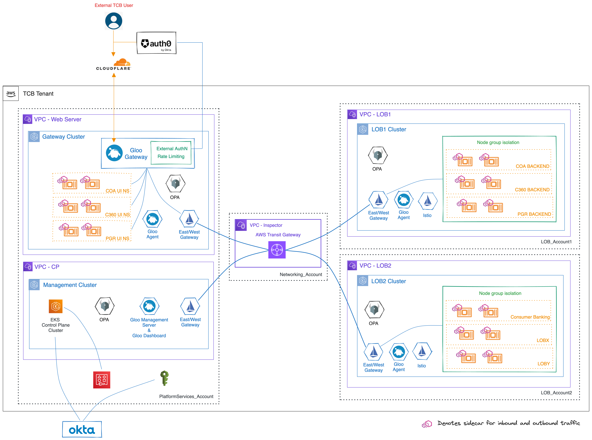

<!--bash
#!/usr/bin/env bash

source ./scripts/assert.sh
-->


# <center>Proof of Concept</center>
## <center>Prepared for Texas Capital Bank</center>


## Table of Contents
* [Introduction](#introduction)
* [Lab 1 - Deploy EKS clusters](./01-deploy-eks-clusters/README.md)
* [Lab 2 - Deploy Gloo Platform](./02-deploy-gloo-platform/README.md)
* [Lab 3 - Deploy Istio](./03-deploy-istio/README.md)
* [Lab 4 - Deploy Gloo Platform Addons](./04-deploy-gloo-platform-addons/README.md)
* [Lab 5 - Certificate Management](./05-certificates/README.md)
* [Lab 6 - Deploy Online Boutique](./06-deploy-online-boutique/README.md)
* [Lab 7 - Configure Gloo Platform](./07-configure-gloo-platform/README.md)
* [Lab 8 - Ingress](./08-ingress/README.md)
* [Lab 9 - Zero Trust Communication](./09-zero-trust/README.md)
* [Lab 10 - Multi Cluster Secure Communication](./10-multi-cluster/README.md)
* [Lab 11 - Observability](./11-observability/README.md)
* [Lab 12 - Expose APIs](./12-expose-apis/README.md)
* [Lab 13 - Circuit Breaking and Failover](./13-circuit-breaking/README.md)
* [Lab 14 - Rate Limiting](./14-feature-rate-limiting/README.md)
* [Lab 15 - Authentication / JWT + JWKS](./15-feature-jwt/README.md)
* [Lab 16 - Gloo Platform OPA Integration](./16-feature-opa/README.md)
* [Lab 17 - Calling External Services](./17-feature-external-services/README.md)
* [Lab 18 - Day 2 Certificates](./18-feature-day2-certificates/README.md)
* [Lab 19 - Zero Downtime Istio Upgrades](./19-feature-zero-downtime-upgrade-istio/README.md)
* [Lab 20 - POC Clean Up](./20-poc-cleanup/README.md)


## Introduction <a name="introduction"></a>


[Gloo Platform](https://www.solo.io/products/gloo-platform/) integrates API gateway, API management, Istio service mesh and cloud-native networking into a unified application networking platform. It allows you to manage gateway and service mesh together across single or multiple clusters and multiple teams.

Gloo Platform can help solve some of these challenges:

- Zero trust security architecture for APIs and microservices
- Combine north-south and east-west traffic management (API gateway + service mesh)
- Unified failover and security policy across gateway and mesh 
- Aligning with the leading approaches to software development
- Scale across multiple dimensions (multi-cluster, multi-tenant, multi-cloud)



## Before You Start

Before starting this POC workshop, it is important that you setup with the right components and tooling in place to ensure success. 

### Supporting Tools

The below tools are designed to help you understand and debug your environment.

- istioctl - Istio CLI `curl -L https://istio.io/downloadIstio | sh -`
- helm v3 - [Helm CLI](https://helm.sh/docs/intro/install/)
- curl - https://everything.curl.dev/get
- docker - [Docker CLI](https://docs.docker.com/get-docker/)

### Documentation and Examples

* Gloo Platform Docs - https://docs.solo.io/gloo-mesh-enterprise/

Solo.io documentation is great for getting to know the Gloo Platform. From examples to API documentation, you can quickly search and find help. It is recommended that you read through the Gloo Platform concepts before getting started. 

* Gloo Platform Concepts - https://docs.solo.io/gloo-mesh-enterprise/latest/concepts/
* API Reference - https://docs.solo.io/gloo-mesh-enterprise/latest/reference/api/

### Cluster Setup


This POC depends on our typical *3 cluster environment* where one cluster will be used for the administration (management) of the other two clusters (cluster-1 and cluster-2), which run the gateway, service mesh and your workloads. 

The best way to facilitate the POC is by creating 3 new Kubernetes clusters in your environment so that you can test Gloo Platform without impacting other teams and workloads.
Although, most prospects will want to test that Gloo Platform works in their "real" environments, its important for users to understand Gloo Platform first.
This not only gives the prospect time to learn Gloo Platform but also helps the Solo.io Architects understand the requirements of your environment. 
Prospects are welcome to deploy Gloo Platform to their "real" environments once they have a good grasp of the operational and architectural impacts it will have on their environment. 

If the POC has to be performed on existing shared clusters there are some things to be aware of.

**Networking**

* The 3 clusters MUST have network connectivity with each other (internally or externally) via TCP with TLS.
* The management cluster must be allowed to accept mTLS traffic without termination on ports 9900 and 4317. The preferred way to expose these ports is via **TCP Passthrough** load balancers.
  * Optionally if `NodePorts` are required due to the lack of load balancer support, the prospect must be aware of the Node IP addresses it gives each Gloo Agent. There is a chance for the Node to be recreated with a different IP address and thus would drop the connection from the Gloo Agent. 


### Sizing 

* Each cluster should be able to connect to the LoadBalancer address attached to the other clusters by either internal or external networking.
* Minimum Cluster Resource Sizing
  * Management Cluster (mgmt):
    - Nodes: 2
    - CPU Per Node: 4vCPU
    - Memory Per Node: 16Gi
  * Each Workload Cluster (cluster-1 and cluster-2):
    - Nodes: 2
    - CPU Per Node: 4vCPU
    - Memory Per Node: 16Gi

### Private Image Repository

Some organizations do not allow public docker repository access and need to download the images and upload them to a private repository. 

* To view the images that are used in this POC, run `cat images.txt` 

The easiest way to get the images in your repository is to pull the listed images, retag them to your internal registry and push. 


### Helm charts

The following helm charts are used in this POC or may be needed depending on your use cases.

```shell
# required
helm repo add gloo-platform https://storage.googleapis.com/gloo-platform/helm-charts
helm pull oci://us-central1-docker.pkg.dev/solo-test-236622/solo-demos/onlineboutique

# Optional addons
helm repo add istio https://istio-release.storage.googleapis.com/charts
helm repo add hashicorp https://helm.releases.hashicorp.com
helm repo add prometheus-community https://prometheus-community.github.io/helm-charts
helm repo add jaegertracing https://jaegertracing.github.io/helm-charts
helm repo add jetstack https://charts.jetstack.io
helm repo update
```


